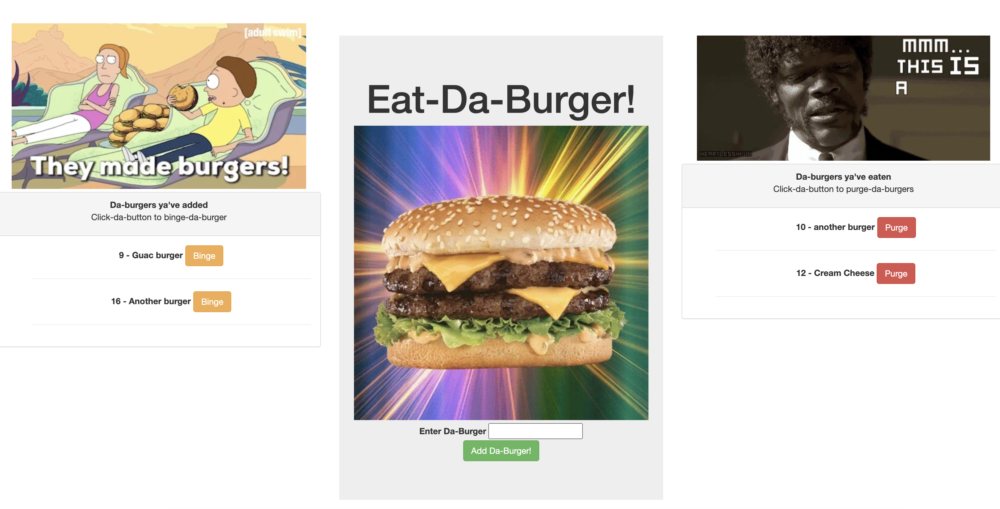

# Burger Logger
    
## Table of Contents

  - [Description](#description)
  - [Installation](#installation)
  - [Usage](#usage)
  - [Credits](#credits)
  - [License](#license)
  - [Contributing](#contributing)
  - [Questions](#questions)
    
## Description
    
For anyone that wants to track burgers by adding them to a list, marking that they've been eaten and seeing what they've eaten, plus deleting. 

    
## Installation
    
- Navigate to "https://note-taker-pbm.herokuapp.com/" 
- Voila!
    
## Usage
    
- Giving 100% on homework
- Adding a burger, seeing a list of burgers added
- Marking a burger has been eaten by clicking "binge", seeing a list of burgers eaten
- Purging burgers previously eaten 

## Credits

- Trilogy app "Cat App"
- https://www.youtube.com/user/daventertainmentdj - Great tutorial! 
    
## License

[mit](https://choosealicense.com/licenses/mit/)
    
## Contributing
    
If you would like to contribute it, please utilize The [Contributor Covenant](https://www.contributor-covenant.org/) as a guideline.
    
## Questions
    
### What's your GitHub info?
    
My GitHub username is pmo48 and my profile can be found at github.com/pmo48
    
### What other contact info do you have?
    
I can be contacted via email at pmoriarty100@gmail.com if you have any additional questions.